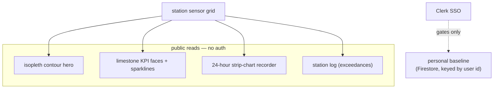

# oriz-envpact-dashboard-app — environmental-impact field station

> A field-station instrument for carbon intensity, air quality, and sequestered load across a sensor network — one dashboard, not a marketing page.

[](./LICENSE)
[](https://github.com/chirag127/oriz-envpact-dashboard-app/stargazers)
[](https://github.com/chirag127/oriz-envpact-dashboard-app/commits/main)
[](https://github.com/chirag127/oriz-envpact-dashboard-app/actions/workflows/ci.yml)
[](https://astro.build)

## What it is / why it exists

A data-instrument dashboard for environmental impact across a field-station sensor grid. The hero is a live isopleth contour reading; below it sit limestone KPI faces with sparklines, a 24-hour strip-chart recorder, and a station log flagging exceedances. It reads as a scientific instrument, deliberately not eco-green marketing. Public station data is open to everyone with no sign-in; Clerk auth exists only so a signed-in steward can pin a personal baseline that follows their oriz.in account across subdomains.

## Links

- **Live site:** https://envpact-dashboard-app.oriz.in _(canonical — Cloudflare Pages)_
- **Repo:** https://github.com/chirag127/oriz-envpact-dashboard-app

_No GitHub Pages info page for this repo — envpact-dashboard-app.oriz.in is the canonical URL._

⭐ If this is useful, please **star the repo** — it helps others find it.

## How it works



## Features

- **Isopleth contour reading (signature)** — a drawn contour band across the station grid, the station's most characteristic artifact.
- **KPI faces with sparklines** — carbon intensity, air quality, sequestered load; each mineral hue carries a reading (ochre = warming, verdigris = captured/offset, clay = exceedance).
- **24-hour strip-chart recorder** and a **station log** that flags exceedances.
- **Public reads, open to all** — no sign-in for any station data.
- **Personal baseline (optional)** — sign in only to pin the metrics you steward; the baseline follows your oriz.in account (Clerk SSO).

## Tech stack

- **Astro 6** static site + **React 19** islands.
- **@clerk/clerk-react** — auth for the personal baseline only (shared `*.oriz.in` SSO).
- **Firebase (Firestore only)** — small per-user data, keyed by Clerk user id (Clerk owns auth).
- Config via `import.meta.env.PUBLIC_*`; publishable keys only, no server secrets in source.
- Deployed to **Cloudflare Pages** (see `wrangler.toml`, `CNAME`).

## Repo structure

```
src/                 # Astro pages + React islands (dashboard surfaces)
docs/                # design + data notes
astro.config.mjs     # site: https://envpact-dashboard-app.oriz.in
wrangler.toml        # Cloudflare Pages config
CNAME                # envpact-dashboard-app.oriz.in
CHANGELOG.md         # release history
.env.example         # Clerk + Firebase PUBLIC_* names
```

## Quick start

Windows: use **npm**, not pnpm (pnpm skips `@esbuild/win32-x64`).

```bash
npm install --legacy-peer-deps
npm run dev        # http://localhost:4321
npm run build      # → dist/
npm run preview    # preview the build
```

Deploy to Cloudflare Pages:

```bash
npm run build
npx wrangler pages deploy dist --project-name oriz-envpact-dashboard-app --branch main --commit-dirty=true
```

## Configuration

Names + purpose only — never commit real values. All are `PUBLIC_*` (they reach the browser by design); there is no server secret in this repo.

| Variable | Purpose |
| --- | --- |
| `PUBLIC_CLERK_PUBLISHABLE_KEY` | Clerk publishable key; gates *only* the personal baseline. |
| `PUBLIC_FIREBASE_API_KEY` | Firebase Web API key (Firestore client). |
| `PUBLIC_FIREBASE_AUTH_DOMAIN` | Firebase auth domain. |
| `PUBLIC_FIREBASE_PROJECT_ID` | Firebase / Firestore project id. |
| `PUBLIC_FIREBASE_STORAGE_BUCKET` | Firebase storage bucket. |
| `PUBLIC_FIREBASE_MESSAGING_SENDER_ID` | Firebase messaging sender id. |
| `PUBLIC_FIREBASE_APP_ID` | Firebase app id. |

## Screenshots

_Placeholder — add a capture of the isopleth hero + KPI faces._

## Part of the oriz family

One of ~80 sites in the **oriz** family. See how the fleet is built at [blog.oriz.in](https://blog.oriz.in).

- **Cost:** $0 on the Cloudflare free tier.

## Security

No secrets in the repo; the fleet uses a **sops + age** vault (`.env.enc`). Only `PUBLIC_*` client keys ship to the browser; the Clerk secret key is never present here and never named `PUBLIC_*_SECRET`.

## Contributing

Issues and PRs welcome — keep them terse. Conventional commits, `main`-only.

## Status / roadmap

Live at envpact-dashboard-app.oriz.in. See [CHANGELOG.md](./CHANGELOG.md) for history.

## Changelog

Conventional commits are the changelog; see [CHANGELOG.md](./CHANGELOG.md).

## License

MIT © 2026 Chirag Singhal — see [LICENSE](./LICENSE).

## Author

Chirag Singhal · chirag@oriz.in
